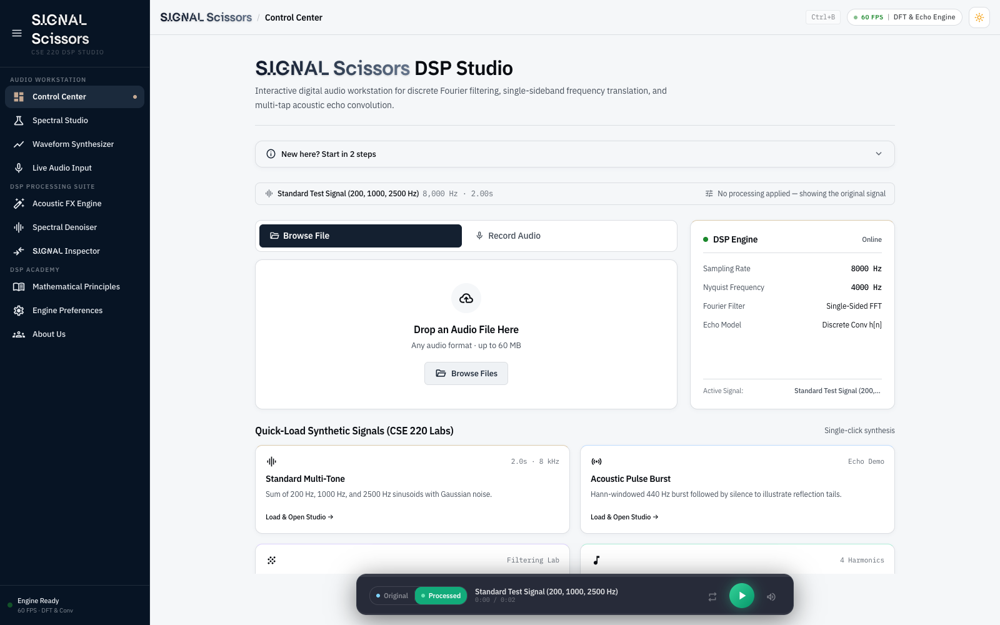
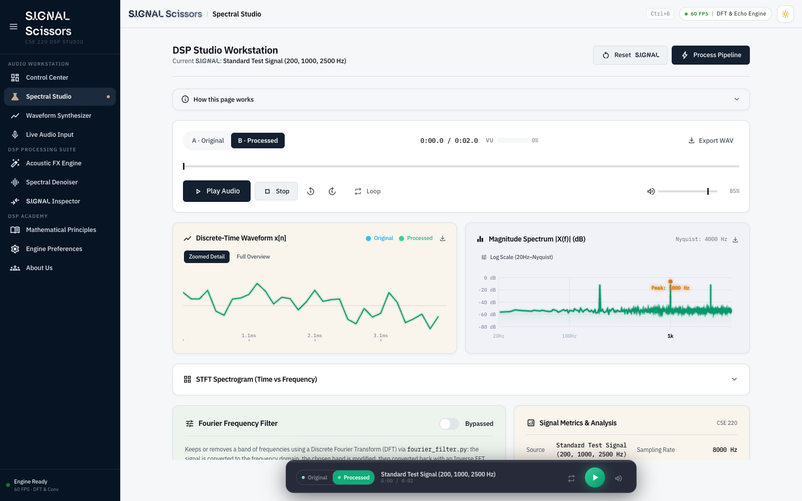
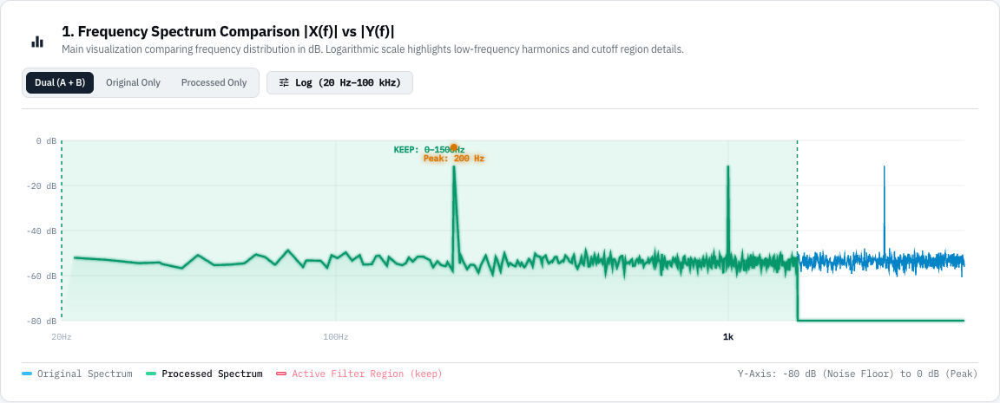
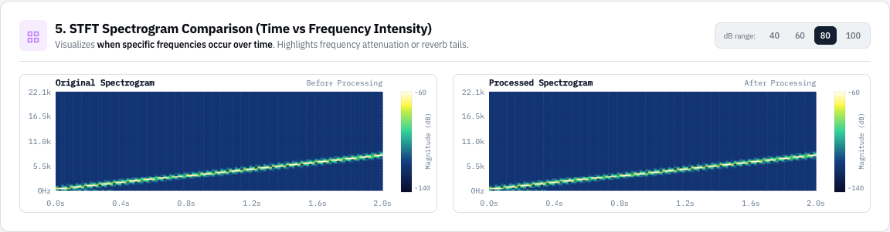

# Signal Scissors

An interactive digital signal-processing (DSP) workstation for exploring Fourier-domain filtering and
LTI (Linear Time-Invariant) systems — built as a CSE 220 (Signals & Systems Sessional) final project.
Signal Scissors is a React/Vite workstation backed by a Python FastAPI + NumPy/SciPy DSP engine.

**Team**

| Name | Student ID |
|---|---|
| Al Arafat Alif | 2305062 |
| Safwan Bin Ahmadul Hoque | 2305087 |

Department of CSE, Bangladesh University of Engineering and Technology (BUET).

## What it does

Audio DSP theory is usually either a black-box knob or a dry equation on a board. Signal Scissors closes
that gap: load, synthesize, or record a signal, apply a real FFT-based filter or LTI operation, and
immediately see the result in the time and frequency domains *and* hear it played back.

Every DSP operation in the app is implemented directly with NumPy/SciPy (no black-box audio libraries for
the core pipeline) — FFT band filtering, amplitude scaling, time-shifting, single-sideband frequency
translation via an analytic (Hilbert-style) signal, and discrete convolution echo.

## Features

- **Control Center** — load a signal three ways: browse a WAV file, record from your microphone (with a
  listen-back/re-record step before it's committed), or quick-load a synthetic test preset (known,
  exact frequencies for verifying filters).
- **Spectral Studio** — the main workstation: a Fourier frequency-domain band filter (cut / keep /
  attenuate / amplify a frequency range), plus an effects rack (amplitude gain, time delay, SSB frequency
  shift, and multi-tap convolution echo), with live waveform, spectrum, and STFT spectrogram views.
- **Signal Inspector** (`/compare`) — a deep-dive comparison page: original-vs-processed spectrum overlay,
  a ΔdB frequency-difference plot, waveform overlay, STFT spectrogram, and quantitative metrics (RMS,
  peak, dominant frequency, duration).
- **Acoustic FX Engine** (`/effects`) — real-world DSP scenarios (telephone bandwidth filtering, 60 Hz hum
  notch, reverb, hearing-aid style compensation, Doppler shift, and more) as one-click presets.
- **Spectral Denoiser** (`/noise-remover`) — FFmpeg-based background-noise reduction for recordings, with
  Light/Balanced/Strong presets (a separate subsystem from the FFT/LTI pipeline above).
- **DSP Academy** (`/theory`) — the underlying math (DFT, Nyquist/aliasing, LTI convolution, SSB
  modulation, spectral subtraction, band filtering) plus 6 interactive canvas simulations.

## Screenshots

**Control Center** — load, record, or synthesize a signal; presets and current signal/processing status
always visible:



**Spectral Studio** — original vs. processed waveform and spectrum, with the Fourier filter and effects
rack:



**Signal Inspector** — a multi-tone signal (200/1000/2500 Hz) through a 0–1500 Hz *Keep* filter; the
2500 Hz peak is removed while the others are untouched:



**STFT Spectrogram** — a linear chirp (200 Hz → 8000 Hz) showing the frequency rising over time:



## Project layout

- `frontend/` — the active React/Vite interface (pages, components, DSP-result visualizers).
- `backend/` — the FastAPI server and the DSP modules:
  - `fourier_filter.py` — FFT spectrum computation and frequency-band filtering (cut/keep/attenuate/amplify).
  - `audio_effects.py` — amplitude scaling, time-shift/delay, convolution echo, and voice effects.
  - `signal_analysis.py` — RMS, peak amplitude, dominant frequency.
  - `signal_io.py` — WAV loading/synthesis, mono downmixing, normalization.
  - `server.py` — FastAPI routes, signal state, SSB frequency shift, spectrogram computation.
  - `noise_service.py` / `noise_routes.py` / `noise_config.py` — the FFmpeg-based Noise Remover subsystem.
- `presentation/` — the CSE 220 final-project slide deck (LaTeX Beamer source) and speaker notes.
- `frontend-template/` — a preserved, separate frontend template; not part of the active app.
- `audio/` — sample media at the project root (ownership ambiguous, kept here for convenience).

## Backend

Create or activate the Python environment, install the backend dependencies, then start FastAPI:

```bash
cd backend
python -m pip install -r requirements.txt
python -m uvicorn server:app --reload --host 127.0.0.1 --port 8000
```

The API is available at `http://127.0.0.1:8000`, with documentation at `/docs`.

The legacy launcher can also be run from the project root:

```bash
python backend/main.py
python backend/main.py --legacy-gui
```

## Frontend

In a second terminal:

```bash
cd frontend
npm install
npm run dev
```

The Vite development server runs at `http://localhost:5173` and proxies `/api` to the backend at `http://127.0.0.1:8000`.

To build the frontend:

```bash
cd frontend
npm run build
```

For a separately hosted backend, set `VITE_API_BASE_URL` before building or starting Vite:

```bash
VITE_API_BASE_URL=http://127.0.0.1:8000 npm run dev
```

When `frontend/dist` exists, the backend also serves the built frontend from its root route.

## Noise Remover

The **Noise Remover** page (`/noise-remover`) accepts WAV, MP3, M4A, and AAC and runs local server-side FFmpeg noise reduction with Light, Balanced, and Strong settings. Preview the original and cleaned recordings, then download PCM WAV. Defaults: 25 MiB, five minutes of audio, one-hour result retention. Existing workstation audio and settings remain independent.

Install FFmpeg/FFprobe (`brew install ffmpeg` on macOS or `sudo apt-get install ffmpeg` on Debian/Ubuntu). See [Noise Remover setup, API, configuration, security, testing, and troubleshooting](docs/noise-removal.md) and [example backend environment](backend/.env.example).

```sh
.venv/bin/python -m pip install -r backend/requirements-dev.txt
.venv/bin/python -m unittest discover -s backend/tests -v
cd frontend
npm test
npm run lint
npm run build
```

## Final project presentation

The CSE 220 final-project slide deck (LaTeX Beamer, 16:9, source split one file per section) lives in
[`presentation/`](presentation/), along with speaker notes and the demo script in
[`presentation/speaker_notes.md`](presentation/speaker_notes.md). See
[`presentation/README.md`](presentation/README.md) for how to compile it.
